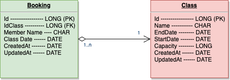
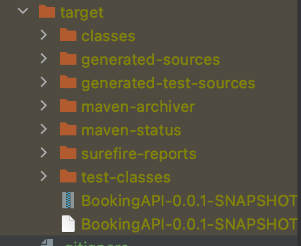
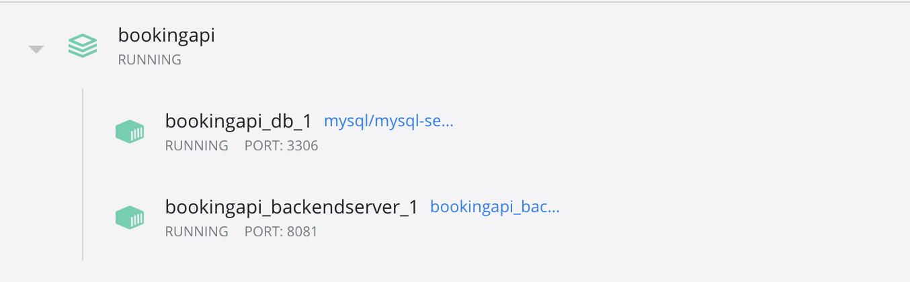
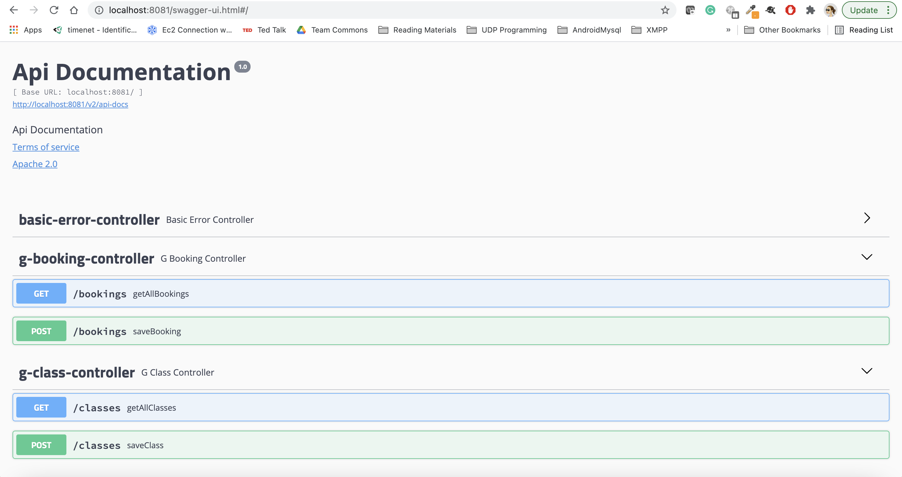
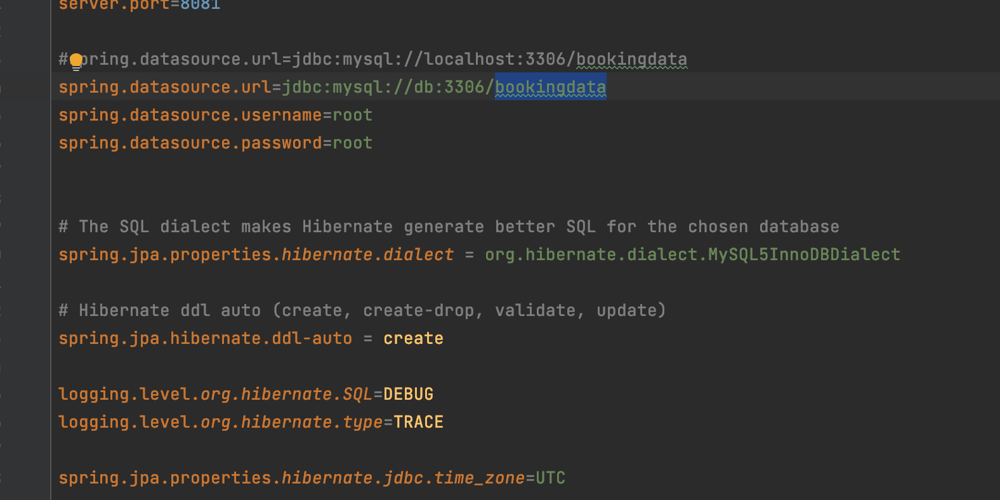
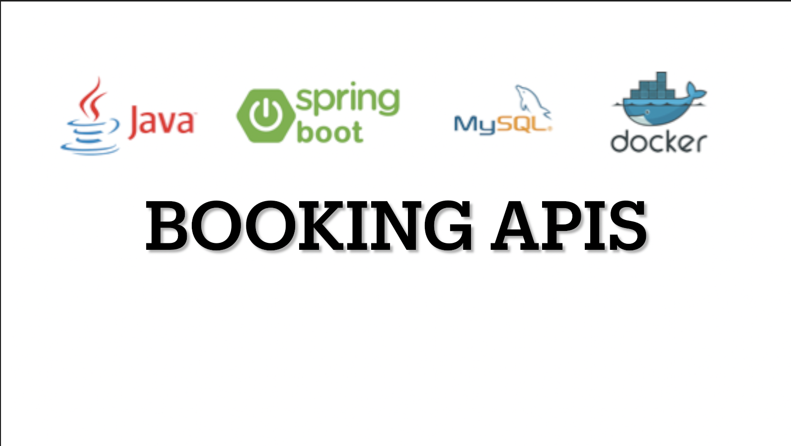

# BookingAPI

This is a small test project to create apis for classes and bookings using Java SpringBoot

## Schema

Classes and Bookings



## How to start the service

### Requirements:


Either of these two are needed to run these services.
1. Docker
2. MySql server (if using mysql the settings are needed to be updated in the application properties)

### Steps

#### Docker

The installation steps are very simple.
1. First we need to package the project if it is not already packged i.e. the target folder has the BookingAPI Jar file

```sh
$ mvn package -DskipTests
```
This step should create target -> BookingAPI-0.0.1-SNAPSHOT.jar 



2. Second we need to build the docker compose

```sh
$ docker-compose up --build -d
```
This step should create two containers:


##### Test

The successful deployment on docker should allow the access of the swagger view which is used to document the apis
Swagger should be accessible here [click here](http://localhost:8081/swagger-ui.html#/)



#### Local Deployment

If docker is not available, project can be opened with IntelliJ IDEA and run from there or Jar file can be used to run directly from the terminal.
1. First step here will be to set the settings for mysql server in application.properties
src->main->resources->application.properties
   
   
It will also be needed to create database in mysql server called **bookingdata** (no need to create tables, they are automatically created on startup)

2. After setting the database we need to package the project

```sh
$ mvn package
```

3. Next we can run the jar created in the target folder

```sh
$ nohup java -jar /BookingAPI-0.0.1-SNAPSHOT.jar &
```

##### Test

The successful deployment should allow the access of the swagger view which is used to document the apis
Swagger should be accessible here [click here](http://localhost:8081/swagger-ui.html#/)


There are also two junit tests in the **src->test** to test the apis, they were created while development of the apis.

## Sample data
1. POST /classes

Here it is important to not pass any `id` or `400` error will occur
```
{
  "capacity": 10,
  "endDate": "2021-09-18T14:23:21.540Z",
  "name": "pilates",
  "startDate": "2021-09-10T14:23:21.540Z"
}
```

2. POST /bookings

As booking is linked with classes it is important to pass the `id` of class
```
{
  "classDate": "2021-09-15T14:36:31.476Z",
  "gclass": {
    "id": 1
  },
  "memberName": "aniqa"
}
```

## Video Tutorial

[](https://youtu.be/jO1NvNxtInA)


